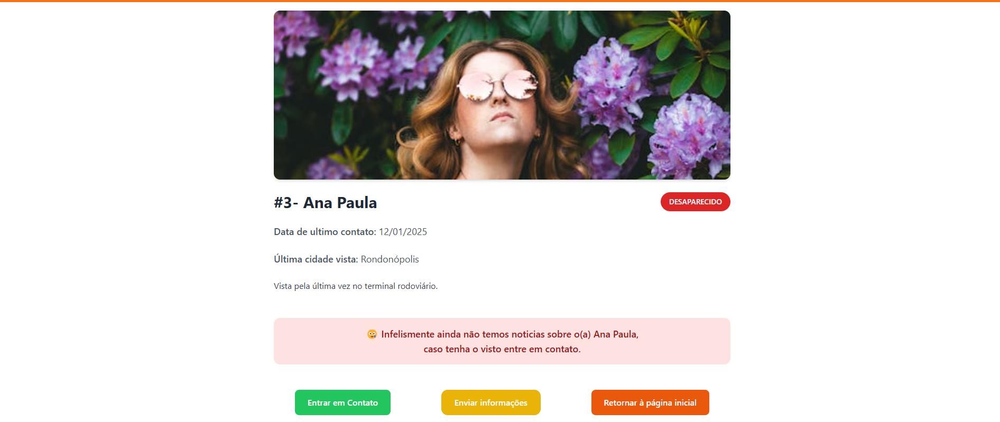
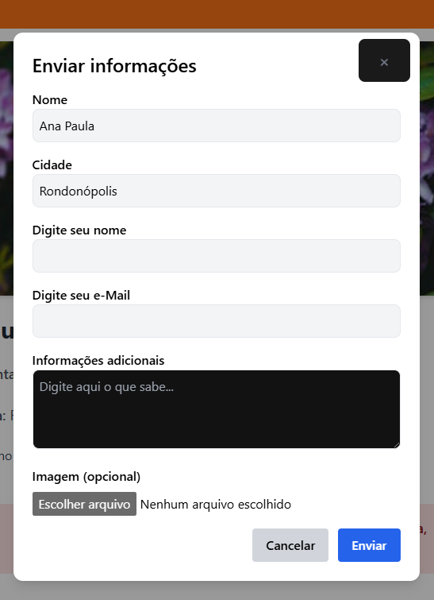

# 👣 Plataforma de Pessoas Desaparecidas

Uma aplicação web desenvolvida com o objetivo de auxiliar na divulgação de casos de pessoas desaparecidas, permitindo que usuários encontrem informações, enviem relatos e visualizem detalhes com uma interface responsiva e moderna.

## 📸 Demonstração


### Listagem geral - Home


### Pagina de Detalhes



### Formulario de envio de informções



## 🚀 Funcionalidades

- Listagem de casos com imagens e informações detalhadas
- Página de detalhes com galeria de imagens e botão para contato via WhatsApp
- Modal com formulário para envio de informações adicionais
- Condicional para exibir mensagem de comemoração quando alguém for encontrado
- Upload de múltiplas imagens
- Feedback de loading durante carregamento
- Design responsivo

## 🛠️ Tecnologias utilizadas

- [React](https://reactjs.org/)
- [TypeScript](https://www.typescriptlang.org/)
- [Vite](https://vitejs.dev/)
- [Tailwind CSS](https://tailwindcss.com/)
- [React Router DOM](https://reactrouter.com/)

## 📦 Como rodar localmente

```bash
# Clone o repositório
git clone https://github.com/seu-usuario/seu-repo.git

# Acesse o diretório
cd seu-repo

# Instale as dependências
npm install

# Inicie o projeto
npm run dev
 ```
## Dados estáticos sem integração com api 08/04/2025
 
## Author
### Josué Ocanha Costa
#### FrontEnd Developer
#### Redes Sociais

- Linkedin - [JosueOcanhaCosta](https://www.linkedin.com/in/josue-ocanha-costa/)
- Github - [JosueCosta2023](https://github.com/JosueCosta2023)
- Twitter - [@JosueOcanhaCosta](https://twitter.com/josue_ocanha)
- Facebook - [JosueCosta](https://www.facebook.com/JosueOcanhaCosta2023)
- Whatsapp - [Josue2023](https://wa.me/5565996408371?text=Ol%C3%A1%2C+encontrei+seu+whatsapp+no+Github.+Gostaria+de+falar+sobre+seus+projetos.)

# "Vida longa e próspera. 🖖🖖🖖"
Feito com o ❤️ por Josué Ocanha Costa
## [Acesse o Deploy](https://github.com/JosueCosta2023/projetoPraticoFrontEndSeplagMT)
### [Acesse o repositório](https://projeto-pratico-front-end-seplag-mt.vercel.app/)
